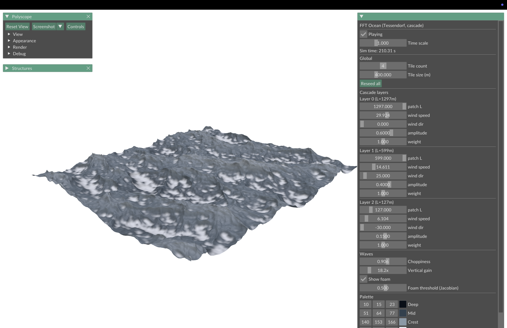
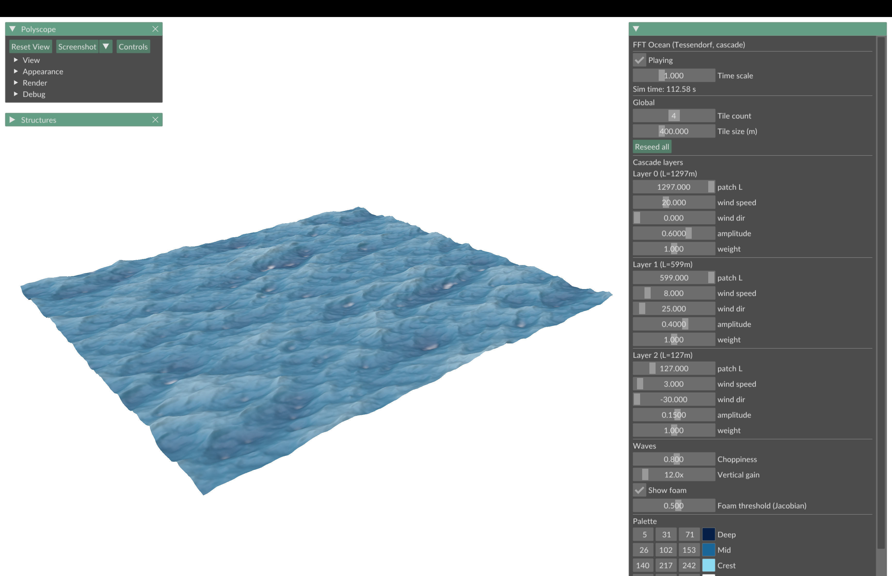
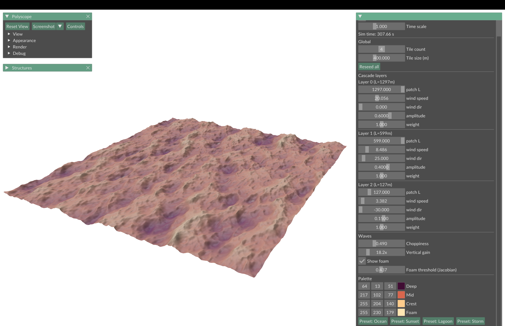
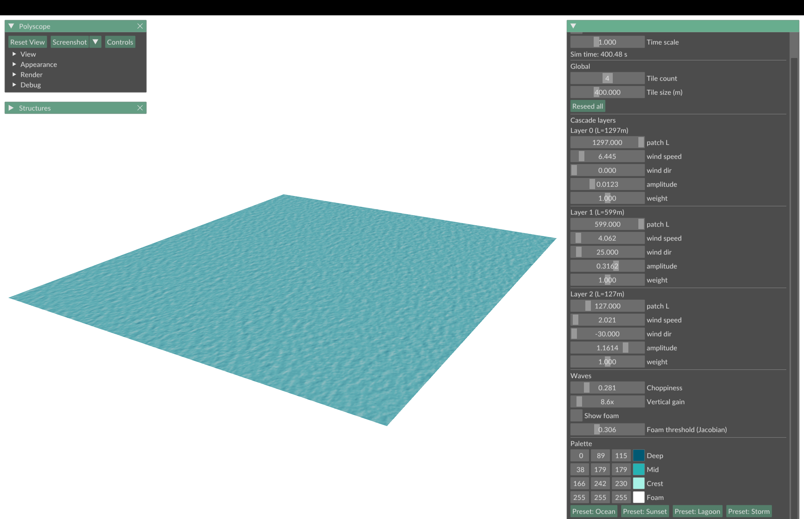

# FFT Ocean

Real-time FFT ocean surface using Tessendorf 2001, with a 3-layer cascade,
choppy displacement, and Jacobian-determinant foam. CS 384P (Physical
Simulation) final project, Spring 2026.



## Layout

- `src/` - Ocean.h, Ocean.cpp, main.cpp
- `tests/test_ocean.cpp` - 36-check sanity suite
- `CMakeLists.txt` - cross-platform build, fetches deps automatically
- `report/report.pdf` - 4-page writeup
- `report/figs/` - screenshots used in the writeup
- `demo.mp4` - narrated walkthrough (~6.5 min)

Dependencies (Polyscope, Eigen, kissfft) are pulled by CMake FetchContent
on first configure, so no system packages are needed.

## Build

Requires CMake 3.20+ and a C++17 compiler.

macOS / Linux:

```
mkdir build && cd build
cmake -DCMAKE_BUILD_TYPE=Release ..
cmake --build . -j
./bin/ocean
```

Optional - run the test suite:

```
cmake --build . --target ocean_tests
./bin/ocean_tests
```

Windows (Visual Studio):

```
mkdir build
cd build
cmake ..
cmake --build . --config Release
.\bin\Release\ocean.exe
```

The first configure pulls Polyscope, Eigen and kissfft from upstream git;
later builds are incremental.

## Running it

Left-mouse drag to orbit, scroll to zoom. The ImGui panel on the right
exposes:

- play/pause and a time scale slider
- per-layer wind speed, direction, patch size L, amplitude, mix weight
- choppiness (0 = pure sines, ~1 = sharp Gerstner-style crests)
- vertical gain (cosmetic, multiplies the rendered heightfield)
- foam toggle and the Jacobian threshold for foam onset
- 4 palette presets (Ocean / Sunset / Lagoon / Storm)
- tile count and tile size for the rendered grid

For the showiest foam: hit the Storm preset, push wind speed to 35 and
choppiness to ~1.2.

## Gallery

| | |
|---|---|
|  |  |
| **Ocean** - default sea, V=20 m/s | **Sunset** - warm palette, moderate sea |
|  |  |
| **Lagoon** - low wind, glassy water | **Storm** - high wind, breaking crests |

All four scenes are produced by the same simulator with different palette
and spectrum knobs. Switch between them with one click.

## Demo video

[demo.mp4](demo.mp4) is a ~6.5 minute narrated walkthrough covering the
algorithm, all three extensions, and the four presets.

## Survey

I have submitted the online course instructor survey for CS 384P (Sp 2026).

## Notes

Solo project, no collaboration report. No starter code was used. External
libraries are unmodified.
